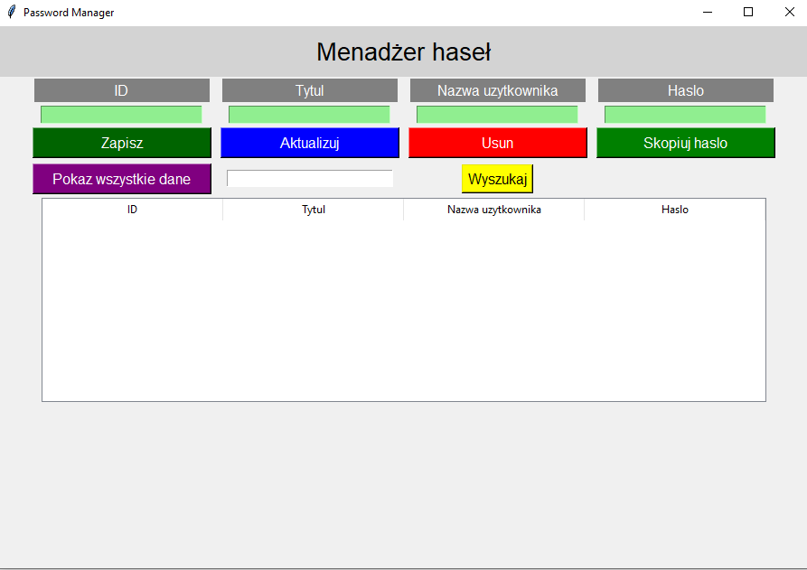

# Menadżer Haseł



Menadżer Haseł to prosta aplikacja do przechowywania haseł stworzona przy użyciu Pythona i biblioteki Tkinter. Umożliwia ona zapisywanie, aktualizowanie, usuwanie i kopiowanie haseł. Wszystkie hasła są przechowywane w lokalnej bazie danych SQLite.

## Wymagania

1. Python 3.7 lub nowszy
2. Tkinter
3. SQLite
4. Pyperclip

## Instrukcje uruchomienia

1. Zainstaluj wymagane pakiety (są w pliku requirements.txt), jeśli nie masz ich jeszcze zainstalowanych. Możesz to zrobić, korzystając z narzędzia `pip` do zarządzania pakietami Pythona:

   ```bash
   pip install tkinter pyperclip

2. Sklonuj repozytorium:

    ```bash
    git clone https://gitlab.com/jakub8812/password-manager.git

3. Przejdź do folderu projektu:

    ```bash
    cd password-manager

4. Uruchom aplikację:

    ```bash
    python password_manager.py